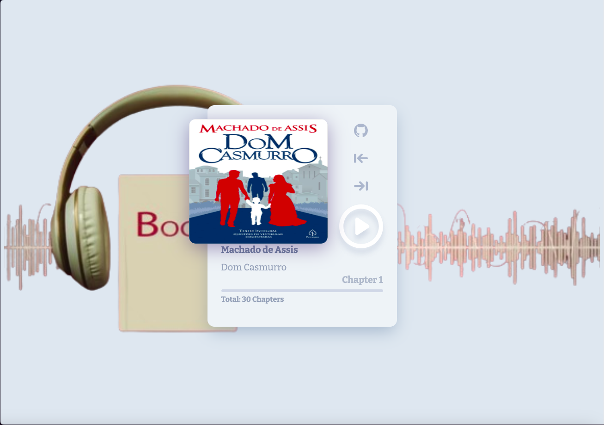

# playbook
## Small Audiobook Player

## Goal :star2:
- [x] Evolving studies with Javascript
- [x] Logic in Javascript
- [x] Functions and Event Handling in the DOM

> [!TIP]
> [Click here or on the image bellow to test the app](https://marinhotjr.github.io/playbook/)

### Credits
> [!NOTE]
> App suggested as an exercise in the js course [Rocketseat](https://app.rocketseat.com.br/home)

**Made with love :heart: by @marinhotjr - 2024**